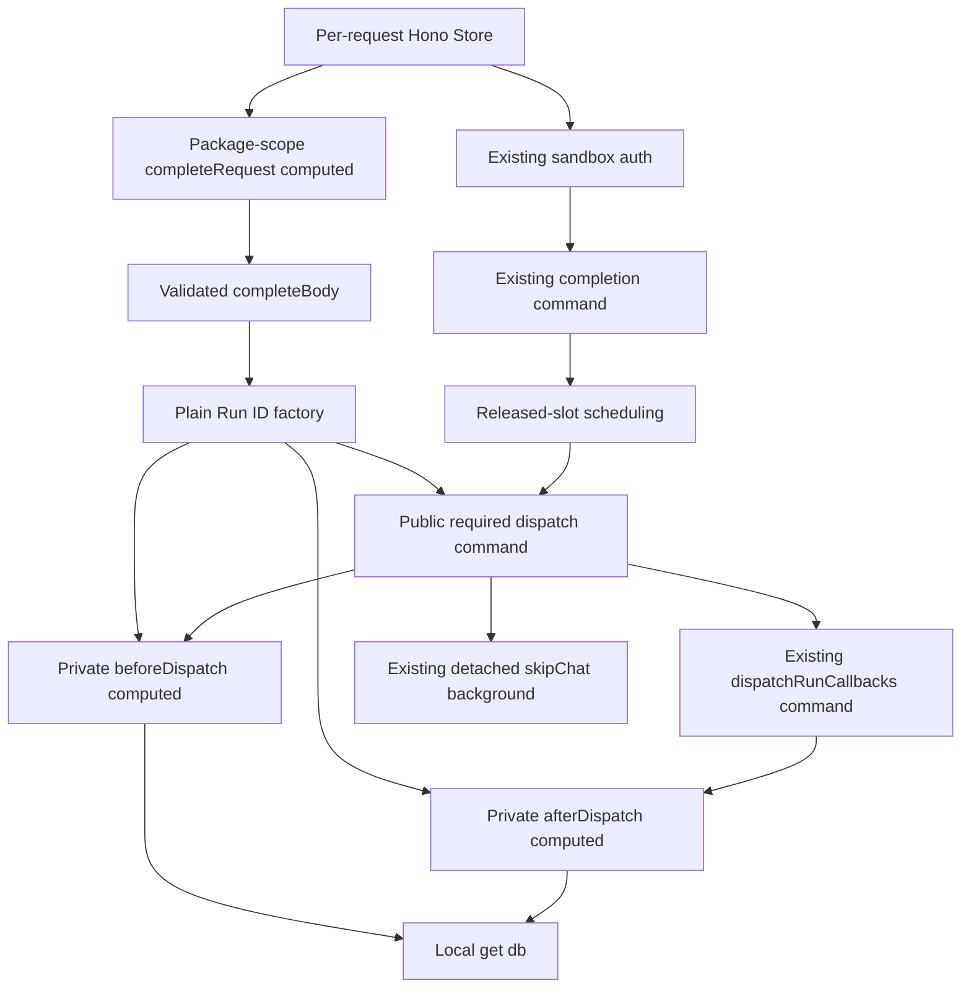

# Required terminal chat callback READ ownership (D4b)

Related to #37513. The parent remains OPEN/PARTIAL. This is a NEW implementation
from main `eee341aeb89028f2670ff390fb1b8a997af7caeb`, not recovery of the lost
uncommitted original draft or proof of byte equivalence to it.

## Scope, graph and public surface

Three production files: the completion webhook route, removal of the old global
required command from `agent-webhook-complete.service.ts`, and the new
`required-terminal-chat-callback.service.ts`. No compatibility export/adapter
remains. `RequiredTerminalChatCallbackResult` is moved unchanged.

The after-read edge is conditional on an absent callback result. Construction
creates two distinct lazy READ nodes, not SQL. The factory accepts only plain
Run ID; its only public node is `dispatch$`. The business command accepts plain
status/error and final caller signal, not result payload, Run ID or whole
terminal side effects. Both nodes obtain `get(db$)` locally. There is no signal
capture, command-time graph construction, mutable input slot, version/reset
counter, cross-request cache, node/accessor/executor/DB injection or new
AgentRunContextSignals exception.

The real route gets one stable request result, authenticates, then calls
`completeAgentRun$` with that validated body. Completion's final
`completionResponse(input.body.runId, commit, redriveTerminalChatCallback)`
places that exact ID into terminal side effects. Therefore captured Run ID is
the former required input Run ID, without an extra SELECT or auth fallback.
Hono creates one Store per request. The sole consumer invokes required dispatch
once; this factory is not a general repeated-dispatch refresh mechanism.

## SQL and business contract

The two READ instances preserve the existing Drizzle expression: select callback
`id`, where Run ID equals the captured ID, kind equals `chat`, status is
`IN ('pending', 'failed')`, `LIMIT 1`. No order/lock/transaction, new projection,
NULL coercion, schema or decoder change. Missing row remains `undefined`.

The first SELECT occurs only after successful terminal completion and slot
scheduling. Missing callback returns success without dispatch. Otherwise the
existing dispatcher receives status/error and the selected redrive chat ID.
Explicit success returns success. Explicit failure retains its error and does
not re-read. An absent result alone performs the second SELECT after dispatch;
missing post-row means success, otherwise the original canonical failure.
The private after node has not been consumed earlier, so it cannot reuse the
before node's memoized result. No pre-read replaces a post-write observation.

Required-owner counts: one SELECT for missing pre-row or explicit result; two
for absent result. Existing outer dispatch still performs Run READ, feature
context READ, then callback candidates READ in that order, and keeps all
pending/failed, skipChat/redrive, retired inline and known/unknown-kind filters.
This PR does not combine snapshots, add SELECTs, parallelize or serialize work.

Existing route/command await checks, settle/tapError/logging, 500 response and
background signal are retained. Order remains completion, slot scheduling,
required dispatch, then detached background skipChat. Computeds capture no
signal; caller checks remain with the command/route. No new pre-SQL abort check.

## Eliminated and residual capabilities

Eliminated: this required owner's two READ handle arguments, old global
required export, and oversized terminal side-effects input to that action.
Private dependencies stay lexical. The route uses ordinary ccstate get/set,
without passing nodes through business arguments.

Residual: required dispatch explicitly uses local `set(writeDb$)` to supply the
existing `dispatchRunCallbacks$` DB argument. This is not full dispatcher
ownership closure or a hidden adapter. The old undelivered helper remains for
completion post-commit terminal redrive and cancel recovery chat-only gating.
D4a, checkpoint, Thread, Pi and other lifecycle owners are not migrated.
D1 internal, D2 deleted-thread writes, D3 HTTP production are untouched,
including cancellation, HMAC/payload, clocks and UPDATE counts. External effects
remain best-effort and may be repeated after abort without result persistence;
no Svix/outbox/receipt/CAS/lock/retry/timeout/exactly-once claim is introduced.

Explicit TX accounting in this READ slice: removed **0**, combined **0**,
retained **0**, moved **0**. Surrounding transactions remain unchanged and are
not claimed as removed. READ provider is the existing production Drizzle/pg
connection: `db$` and `writeDb$` both call `lib/db`, with no replica or snapshot
substitution.

## Testing and historical boundaries

Existing production API regressions remain unchanged: completion/cancellation,
repeated requests, recovery and follow-up Thread events in
`chat-callbacks.bdd.test.ts` and `run-lifecycle.bdd.test.ts`; workflow callback
paths in `workflow-automations.test.ts`. No test is removed or weakened. No local
Vitest/devserver, DB-row/log assertion, internal mock or production hook is
introduced. Existing fixtures are not claimed as production registration APIs.
No public API was identified that deterministically forces absent dispatch
result followed by concurrent delivered post-row disappearance. That precise
post-read interleaving, plus exact AbortSignal/result-persistence schedules,
remain coverage gaps. The D3 503/HMAC case is not proof of this branch.

Original draft's gateways type-check exit **137** remains failure/incomplete,
with OOM unconfirmed. Later missing draft directory and missing session source
remain setup/source failures. New setup's `pnpm exec lefthook version` exit
**254** remains a tooling failure; it is not a project check or retroactive PASS.
The old draft was not restored. D3's ESLint/Semgrep and GraphQL 502 histories
likewise remain failures of their respective steps.

Ethan explicitly authorized only this new D4b PR/current normal commit to defer
`check-types` to natural new-head CI. No local types rerun/cache chase is done.
Official npm `lefthook@2.1.16` is installed in a sandbox-only tooling prefix,
not a project dependency or global install. Executable managed hooks and their
real dispatchers are verified, with unchanged repository hook configuration.
Version-pinned official `LEFTHOOK_EXCLUDE` documentation supports command-name
exclusion. The commit uses exactly `LEFTHOOK_EXCLUDE=check-types`; no group/tag,
Knip, commit-msg exclusion or no-verify. The attempted guessed source-file URL
returned HTTP 404; the authoritative version-pinned documentation was then
located by the GitHub source tree, without retrying installation or changing
versions. An absent-hook inspection returned ls exit 2 before normal managed
installation; no custom hook was overwritten.

Formatting, ESLint, normal/type-aware Oxlint and workspace Knip passed. The first
offline audit command `node /home/user/workspace/d4b-new-sql-audit.cjs` failed
with `ERR_PACKAGE_PATH_NOT_EXPORTED` (exit 1): the DB schema export has import
and types conditions, but no CommonJS require condition. This remains a failed
tooling attempt, not SQL inequality or a retroactive PASS. With explicit
recovery authorization, the existing executable tsx ran an outside-repository
ESM audit using the official `@okouai/db/schema/agent-run-callback` import.
That one corrected comparison exited 0. Actual baseline helper and actual
private READ expression produced identical SQL and ordered bindings for a
fixed synthetic Run ID. Both private node declarations independently call the
same plain-input query factory; the audit records both source constructions.
No SQL was executed, no DB connection was made, and no handwritten schema was
substituted. Serialization proves neither concurrency schedules nor freshness;
those still require the source ownership argument and public regression evidence.
Actual complete non-types pre-commit/commit-msg must pass before push. CI must actually pass
API/shared/App types, Knip, eight API shards and four required gates; skips do
not substitute for types. Exact-head natural CI/job/public-suite evidence is
reported in the PR handoff. Independent review/merge remain separate authority;
this task stops at PR/CI handoff.

## Main integration review boundary

This normal merge integrates main `4844ec7dd63b7854700dc2eb43f5fcf9ba9b41b3`.
The validated request computed constructs both the main completion graph and
the independent required-chat graph from the same plain Run ID. Main D5
post-commit observation is not shared with either D4b before/after node.
The D4b query, DB schema/provider and existing dispatcher bytes are unchanged.
Main also includes Pi recovery ownership; this integration preserves it without
expanding D4b scope. SQL count, predicates and transaction delta remain unchanged.

The old exact-head merge authorization is suspended. The previous single-commit
check-types exclusion does not apply to this integration: complete normal types,
Knip and actual hooks are required. Historical missing-path exit 2 and missing
Lefthook/hooks were setup blockers, not successful checks. Official isolated
Lefthook 2.1.16 setup is separately authorized; repository check configuration
and resource settings are not changed. New-head CI and independent review are
required before any protected merge decision. Exact post-read/AbortSignal
interleaving and reliable/exactly-once delivery remain unproven.

## D6 conflict integration

This second normal integration merges main
`22d6957d33dcfcb3a99b3a268f9deb556f8d0de3` into the original D4b branch.
PR #37732 is D6 initial Run READ ownership, not D7 cancellation redrive.
The complete D6 initial-read, D5 post-commit-read and completion-factory
declarations match this main byte for byte; the D4b private owner matches
`7dc6527f664f46e694c268368c4fcc54581113c9` byte for byte.
The main synchronous inert authorization computed remains unchanged. Its
first consumption follows body await, caller abort check and invalid-body
return, and derives completion identity from validated Run ID and verified
auth user ID. Required before/after observations remain a separate graph.
The four temporal observations do not share memoized results. No SQL/schema/
provider/query count or transaction behavior is modified by this resolution.

The prior 7dc head only had dynamic GitHub Code Quality checks, not complete
repository CI; required types, Knip, API shards and gates were absent. Current
main conflict was a sufficient PR Actions blocker, not proof of the sole
historical cause. The auxiliary wrong-name assertion exited 1 and remains
a failed audit attempt; the explicitly corrected complete-declaration audit
passed separately. No old-head CI or merge authority transfers to a new head.
Exact required post-read and cancellation interleavings remain coverage gaps.
