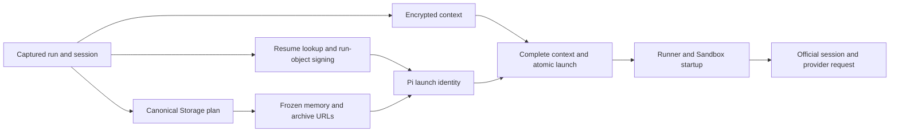

# Pi preparation timing

Current Pi preparation measures API launch assembly and Sandbox session startup.
Every foreground Pi provider turn runs in the Sandbox. API-first activation,
provider ownership, compaction-preflight and credential-revalidation phases are
retired and are no longer part of the runtime phase vocabulary.

## Delivery and fields

The API adapter in
[`pi-preparation-timing.service.ts`](../turbo/apps/api/src/signals/services/pi-preparation-timing.service.ts)
uses the existing sandbox-operation writer and `waitUntil` ownership. Started
launch phases emit content-free completion observations to
`vm0-sandbox-op-log-prod`. The runtime observer and clock helpers live in
[`preparation-timing.ts`](../turbo/packages/pi-agent-runtime/src/preparation-timing.ts).
Sandbox session observations use the CLI/Guest preparation event boundary.

Observer exceptions cannot replace the execution result or own cancellation.
Missing observations are not zero-duration phases. `duration_ms` is monotonic;
`started_at` and `finished_at` are UTC wall boundaries for correlation. An
aborted caller signal labels completion `cancelled`, without adding cancellation
to SDK bootstrap. No prompt/history, credential, signed URL, raw error or
resource identifier enters a phase observation.

## Current phases

| Phase                                         | Executable boundary                                                                                          |
| --------------------------------------------- | ------------------------------------------------------------------------------------------------------------ |
| `launch`                                      | `preparePiLaunchResources`; parent of launch assembly.                                                       |
| `launch_resume`                               | `resolveLatestPiResumeSession`; absent for maintenance.                                                      |
| `launch_memory`                               | `resolvePiMemoryRecall` from captured mounts and versions; absent for maintenance.                           |
| `launch_manifest_sign`, `launch_session_sign` | Signing the ordinary run objects; overlapping children of `launch`. These are not API-first handoff objects. |
| `launch_identity`                             | Resource digest, base-session identity, deadline and final launch-object assembly.                           |
| `resources_prompt`                            | Registry, memory recall/tool metadata, harness prompt, resource options and catalog selection.               |
| `model_runtime`                               | Explicit credential-store selection and model-runtime registration.                                          |
| `session_services`                            | Official foreground services and resource-loader options.                                                    |
| `resource_loader`                             | Resource-option assembly within `session_services`.                                                          |
| `session_create`                              | Official AgentSession construction with captured thinking level and tools.                                   |
| `session_finalize`                            | Persisting the effective configured thinking level.                                                          |

Reconstruct serial boundaries instead of summing parents and children. Use the
union of concurrent signing intervals. Leave observation overhead and gaps
visible; wall-time differences are not SDK CPU time.

## Launch ownership

Canonical Storage planning fixes mount ownership, exact versions and overlay
order. Resume lookup, run-object signing and encrypted-context preparation may
proceed concurrently. Pi memory selection depends on the resolved mount plan.
All started work is settled before launch failure propagates; no previous
attempt's identity is reused after session validation requires a fresh plan.



A preparation success does not establish provider transport, a first response or
run completion. The current provider request starts inside the Sandbox; old API
HTTP spans must not be used as a current foreground transport boundary. Runner
notification is likewise separate from provider start. Inspect the deployed
revision and actual span contract before making a latency claim.

## Observation and historical evidence

The original instrumentation was delivered under
[#33730](https://github.com/vm0-ai/vm0/issues/33730) and launch overlap under
[#33764](https://github.com/vm0-ai/vm0/issues/33764), within
[#33703](https://github.com/vm0-ai/vm0/issues/33703).
[#36082](https://github.com/okou-ai/okou/issues/36082) subsequently measured the
former API activation window. Its API-first phase names and the original
five-attempt cohort are historical records. That cohort averaged 639.6 ms before
API transport, including 63.8 ms unattributed between KMS and ownership. Neither
number measures the current sandbox-first flow or establishes SDK CPU time.

Use exact run IDs, a fixed UTC window and deployed revision when selecting
current observations. Inspect dataset metadata and pagination/truncation state;
project bounded metadata only. API launch and Sandbox startup have different
owners and must not be treated as one population.

```kusto
['vm0-sandbox-op-log-prod']
| where run_id in ('FIXTURE_RUN_1', 'FIXTURE_RUN_2', 'FIXTURE_RUN_3', 'FIXTURE_RUN_4', 'FIXTURE_RUN_5')
| where op_type startswith 'pi_prepare_'
    or op_type startswith 'api_dispatch_phase_'
    or op_type startswith 'api_dispatch_prepare_pi_launch_'
    or op_type startswith 'api_dispatch_prepare_storage_manifest'
    or op_type == 'api_dispatch_build_stored_execution_context'
    or op_type startswith 'api_dispatch_connector_catalog_'
    or op_type startswith 'runner_notification_queue_to_'
| project _time, run_id, op_type, duration_ms, success, outcome,
    started_at, finished_at, trace_id, api_commit_sha,
    logical_queue_created_at, boundary_at, activation_origin,
    api_process_age_bucket, api_process_dispatch_ordinal_bucket,
    cache_hit, cache_lookup_ms,
    connector_catalog_projection_cache_outcome,
    connector_catalog_projection_cache_observation
| sort by run_id asc, _time asc
| limit 1000
```

Keep failures and missing observations in any controlled comparison. Match the
agent, route, priority, reasoning configuration and cold/warm conditions. Code
merge, CI and historical measurements do not establish production acceptance;
release and bounded production observation remain separate controller work.
