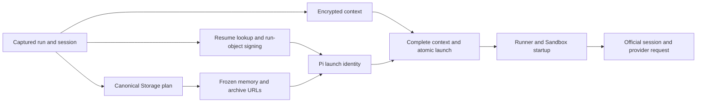

# Pi preparation timing

Current Pi preparation measures Sandbox session startup.
Every foreground Pi provider turn runs in the Sandbox. API-first activation,
provider ownership, compaction-preflight and credential-revalidation phases are
retired and are no longer part of the runtime phase vocabulary.

## Delivery and fields

Sandbox session observations use the CLI/Guest preparation event boundary: the
Guest records `pi_prepare_<phase>` to `vm0-sandbox-op-log-prod`. The runtime
observer and clock helpers live in
[`preparation-timing.ts`](../turbo/packages/pi-agent-runtime/src/preparation-timing.ts).

The API no longer emits `pi_prepare_*` launch observations (`launch`,
`launch_resume`, `launch_memory`, `launch_manifest_sign`, `launch_session_sign`,
`launch_identity`). Their API adapter was retired with the legacy agent-run
execution graph (#37431). API launch work is observed through the
`api_dispatch_*` dispatch timings, for example
`api_dispatch_prepare_pi_launch_resume_session` and the storage manifest
timings.

Observer exceptions cannot replace the execution result or own cancellation.
Missing observations are not zero-duration phases. `duration_ms` is monotonic;
`started_at` and `finished_at` are UTC wall boundaries for correlation. An
aborted caller signal labels completion `cancelled`, without adding cancellation
to SDK bootstrap. No prompt/history, credential, signed URL, raw error or
resource identifier enters a phase observation.

## Current phases

| Phase              | Executable boundary                                                                            |
| ------------------ | ---------------------------------------------------------------------------------------------- |
| `resources_prompt` | Registry, memory recall/tool metadata, harness prompt, resource options and catalog selection. |
| `model_runtime`    | Explicit credential-store selection and model-runtime registration.                            |
| `session_services` | Official foreground services and resource-loader options.                                      |
| `resource_loader`  | Resource-option assembly within `session_services`.                                            |
| `session_create`   | Official AgentSession construction with captured thinking level and tools.                     |
| `session_finalize` | Persisting the effective configured thinking level.                                            |

## S4 startup decomposition

The Guest keeps the original `pi_startup` monotonic start and first projected
`system/init` completion (the official host's `get_state` response). It records
these additive, mutually exclusive `pi_startup_*` segments on the same clock:

| Operation                       | Boundary                                                                |
| ------------------------------- | ----------------------------------------------------------------------- |
| `pi_startup_guest_setup`        | Original startup start to immediately before process spawn.             |
| `pi_startup_process_spawn`      | Process spawn call to successful return.                                |
| `pi_startup_spawn_to_cli_entry` | Spawn return to receipt of the first CLI bootstrap observation.         |
| `pi_startup_cli_initialize`     | CLI entry receipt to receipt of SessionManager completion.              |
| `pi_startup_session_prepare`    | SessionManager receipt to official runtime initialization receipt.      |
| `pi_startup_runtime_ready`      | Runtime initialization receipt to the unchanged first projected record. |

Checkpoints are bounded and flushed at the existing completion boundary. Late
stderr checkpoints beyond that boundary are ignored, so stdout/stderr scheduling
cannot move the root endpoint or inflate the partition. Independently truncated
integer milliseconds can leave less than one millisecond per emitted segment.
If a CLI milestone is missing (old CLI, observation failure, or early process
failure), the currently open segment ends at startup completion instead. Missing
later segments are **not zero**; detailed attribution is unavailable in that
case. The original root success/failure and exactly-once contract are unchanged.

The CLI adds `pi_prepare_` observations for `cli_node_bootstrap`,
`cli_initial_imports`, `cli_instrument`, `cli_entry_imports`, `cli_proxy`,
`cli_command_import`, `cli_config`, `cli_launch_payload`, `cli_credentials`,
`cli_session_file`, `session_manager`, and `runtime_initialize`.
`cli_node_bootstrap` uses Node's native `bootstrapComplete` timestamp;
`cli_initial_imports` covers bootstrap completion through the start of the
existing instrumentation module, including initial ESM graph loading/evaluation.
`cli_entry_imports` covers the remainder through the original main-module body;
`cli_command_import` observes the existing requested-command dynamic import.
No bootstrap loader, imports, credentials, session validation or readiness
checks are bypassed or reordered.

`cli_config` contains `cli_launch_payload` and `cli_credentials`;
`runtime_initialize` contains the existing session-preparation phases;
`session_services` contains `resource_loader`. Only sum the Guest partition,
or select exclusive child intervals. Do not add either set to its parent.
The child carries bounded wall-clock correlation fields, while the Guest still
owns the stored observation timestamp. Node process-relative durations cannot
be subtracted from Guest instants: receipt-time parent boundaries include IPC
and scheduling, and Node initialization can overlap the parent's spawn return.
Any detailed-child residual must be shown rather than clamped or called CPU time.

Timing envelopes use a bounded, synchronous diagnostic-FD write with exceptions
silently ignored; they do not invoke the CLI's stderr EPIPE/exit handler.
There is no new network call, awaited I/O, retry, timer, startup loader or cache.
Only the opted-in private `__agent-loop` process emits CLI-entry observations;
ordinary CLI tool processes stay silent. Runtime observer exceptions retain the
existing best-effort behavior. Test coverage enters through a real CLI process,
a real SDK RPC host, and the Guest process-to-operation-log boundary.

### Version and rollout ownership

Preview CLI artifacts are immutable **commit-SHA** packages, and the Preview
runner image installs that exact package. They do not publish a versioned CLI
release. This instrumentation does not change session-construction semantics or
compatibility floors. New CLI/old Guest keeps existing phases; unknown additive
phases are ignored by the closed parser. Old CLI/new Guest keeps the original
root and reports only the available checkpoint partition.

Use a visible conventional `feat(cli)` commit for the CLI, Runtime and Guest
source changes. Release-please owns their package/Cargo versions and workspace
propagation; do not manually desynchronize package versions from its manifest.
Before any separately authorized release, the generated release must advance the
CLI version beyond the currently published version and also include Runtime and
Guest version updates. The immutable versioned-artifact publisher still rejects
same-version/different-content bundles. A green SHA Preview is not evidence that
a versioned release was published or that all runners have updated.

Reconstruct serial boundaries instead of summing parents and children. Use the
union of concurrent signing intervals. Leave observation overhead and gaps
visible; wall-time differences are not SDK CPU time.

## Launch ownership

Canonical Storage planning fixes mount ownership, exact versions and overlay
order. Resume lookup, run-object signing and encrypted-context preparation may
proceed concurrently. Pi memory selection depends on the resolved mount plan.
All started work is settled before launch failure propagates; no previous
attempt's identity is reused after session validation requires a fresh plan.



A preparation success does not establish provider transport, a first response or
run completion. The current provider request starts inside the Sandbox; old API
HTTP spans must not be used as a current foreground transport boundary. Runner
notification is likewise separate from provider start. Inspect the deployed
revision and actual span contract before making a latency claim.

## Launch commit and first-output boundaries

`committedAtomicLaunchResponse` still checkpoints
`api_dispatch_phase_queue_insert` at `runnerJobCreatedAt`, the logical row
creation time. This is not commit completion: `api_dispatch_phase_commit`
ends when the launch transaction returns. The additive
`logical_queue_created_at` and `boundary_at` fields on Runner notification
milestones identify their endpoints; compare boundaries or subtract cumulative
values instead of summing them. Existing `api_to_*`, first-assistant publication
and dispatch phase definitions remain unchanged.

Guest startup, first model output, WebSocket delivery and API ingestion have
separate owners. See [chat-first-output-latency.md](chat-first-output-latency.md)
for their exact event and observation boundaries. These observations do not
restore an API-side provider turn; every foreground provider request starts in
the Sandbox.

## Observation and historical evidence

The original instrumentation was delivered under
[#33730](https://github.com/vm0-ai/vm0/issues/33730) and launch overlap under
[#33764](https://github.com/vm0-ai/vm0/issues/33764), within
[#33703](https://github.com/vm0-ai/vm0/issues/33703).
[#36082](https://github.com/okou-ai/okou/issues/36082) subsequently measured the
former API activation window. Its API-first phase names and the original
five-attempt cohort are historical records. That cohort averaged 639.6 ms before
API transport, including 63.8 ms unattributed between KMS and ownership. Neither
number measures the current sandbox-first flow or establishes SDK CPU time.

Use exact run IDs, a fixed UTC window and deployed revision when selecting
current observations. Inspect dataset metadata and pagination/truncation state;
project bounded metadata only. API launch and Sandbox startup have different
owners and must not be treated as one population.

```kusto
['vm0-sandbox-op-log-prod']
| where run_id in ('FIXTURE_RUN_1', 'FIXTURE_RUN_2', 'FIXTURE_RUN_3', 'FIXTURE_RUN_4', 'FIXTURE_RUN_5')
| where op_type startswith 'pi_prepare_'
    or op_type startswith 'api_dispatch_phase_'
    or op_type startswith 'api_dispatch_prepare_pi_launch_'
    or op_type startswith 'api_dispatch_prepare_storage_manifest'
    or op_type == 'api_dispatch_build_stored_execution_context'
    or op_type startswith 'api_dispatch_connector_catalog_'
    or op_type startswith 'runner_notification_queue_to_'
| project _time, run_id, op_type, duration_ms, success, outcome,
    started_at, finished_at, trace_id, api_commit_sha,
    logical_queue_created_at, boundary_at, activation_origin,
    api_process_age_bucket, api_process_dispatch_ordinal_bucket,
    cache_hit, cache_lookup_ms,
    connector_catalog_projection_cache_outcome,
    connector_catalog_projection_cache_observation
| sort by run_id asc, _time asc
| limit 1000
```

Keep failures and missing observations in any controlled comparison. Match the
agent, route, priority, reasoning configuration and cold/warm conditions. Code
merge, CI and historical measurements do not establish production acceptance;
release and bounded production observation remain separate controller work.
