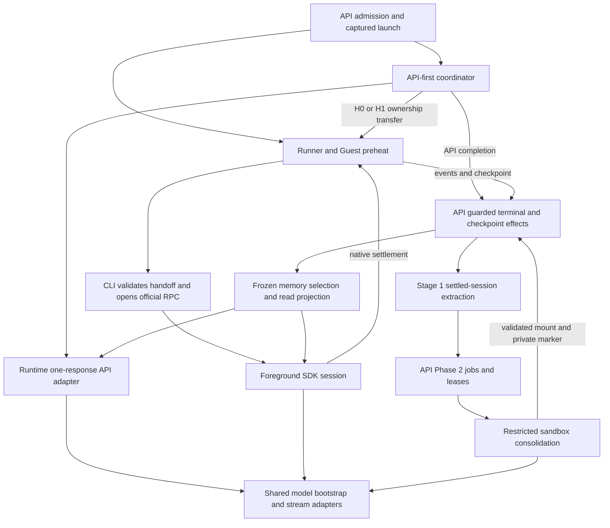

# Pi runtime architecture

This is the whole-system responsibility and compatibility map for
[#33519](https://github.com/vm0-ai/vm0/issues/33519). It describes execution and
memory boundaries consolidated by A–D, without defining a new harness,
route policy, wire format, or release gate. The linked source owns executable
behavior; the detailed contracts below own their respective implementation and
rollout rules.

## Authorities and dependencies

- [API-first transition contract](../turbo/apps/api/src/signals/services/pi-api-first-turn.md):
  decisions, request/publication ownership, guarded effects, and late usage.
- [Pinned SDK integration](../turbo/patches/pi-pending-tools.md): Pi **0.85.1**,
  pending tools, cancellation, next-response preparation, and session fixtures.
- [Bash spool contract](../turbo/packages/pi-agent-runtime/bash-spool-backpressure.md):
  actual local-tool consumers, backpressure, interruption, and verification.
- [Deployment compatibility](./deployment-compatibility.md): independently
  deployed API/Runner/Sandbox, commit-addressed CLI, history, and memory readers.
- [Native provider preparation](./pi-native-provider-preparation.md): native
  transport, credential/billing ownership, and the original activation gates.
  Current admission remains owned by the API source, not that preparation ledger.
- [Preparation timing](./pi-preparation-timing.md): bounded initialization and
  launch observations, transaction/activation boundaries, and transport correlation.
- [Memory/citation provenance](../turbo/packages/pi-agent-runtime/src/memory-recall-upstream.md)
  and [delimiter boundary](./citation-delimiter-literals.md): canonical parser,
  derived text, historical reads, and upstream attribution.

Arrows describe calls or transfer of validated data, not shared cancellation or
accounting ownership. Pure route/policy/projection modules never import API
services or a command accessor.

| Responsibility                      | Source and dependency boundary                                                                                                                                                                                                                                                                                                                                                                                                                                                                                                                                                                                                                                                                                                                                     |
| ----------------------------------- | ------------------------------------------------------------------------------------------------------------------------------------------------------------------------------------------------------------------------------------------------------------------------------------------------------------------------------------------------------------------------------------------------------------------------------------------------------------------------------------------------------------------------------------------------------------------------------------------------------------------------------------------------------------------------------------------------------------------------------------------------------------------ |
| Admission and captured identity     | [pi-sandbox-config.ts](../turbo/apps/api/src/signals/services/pi-sandbox-config.ts), [agent-run-create.service.ts](../turbo/apps/api/src/signals/services/agent-run-create.service.ts), and [dispatch](../turbo/apps/api/src/signals/services/pi-api-first-turn-dispatch.service.ts) fence eligible sources and capture `piModelConfig`. Eligible default-off `piDeferredSandbox` chat starts commit a v4 Run plus immutable H0/resources before full Runner preparation; other starts retain the complete legacy launch. Authorization, queue-first input, account, credit, catalog and original API-clock owners are shared.                                                                                                                                     |
| Route normalization and credentials | [execution-route.ts](../turbo/packages/pi-agent-runtime/src/execution-route.ts) normalizes supported carriers into the in-process `PiExecutionRoute`; [credential.ts](../turbo/packages/pi-agent-runtime/src/credential.ts) snapshots it before asynchronous materialization. The original wire remains authoritative for claim capability and telemetry. Credential references are captured; secrets are materialized only at the API or firewall execution edge.                                                                                                                                                                                                                                                                                                 |
| API-first ownership                 | [registration](../turbo/apps/api/src/signals/services/pi-api-first-turn-registration.service.ts) owns cancellation registration/release; [coordinator](../turbo/apps/api/src/signals/services/pi-api-first-turn.service.ts) owns preparation and guarded effects; [policy](../turbo/apps/api/src/lib/pi-api-first-turn-policy.ts) receives immutable facts. The [lifecycle lock](../turbo/apps/api/src/signals/services/pi-api-first-turn-lifecycle.service.ts) is shared with cancellation and active-input reservation. Durable mode commits `may-have-started` before HTTP and [recovery](../turbo/apps/api/src/signals/services/pi-api-inference-recovery.service.ts) advances the same epoch for lost ready/publication owners without replaying uncertainty. |
| SDK model boundary                  | [session-model.ts](../turbo/packages/pi-agent-runtime/src/session-model.ts) owns explicit resource-registry initialization, registered model description, and fixed `ModelRuntime` bootstrap. [model.ts](../turbo/packages/pi-agent-runtime/src/model.ts), [native-stream.ts](../turbo/packages/pi-agent-runtime/src/native-stream.ts), and [native-http.ts](../turbo/packages/pi-agent-runtime/src/native-http.ts) own catalog/transport adaptation and request guards.                                                                                                                                                                                                                                                                                           |
| Session shells                      | [session-runtime.ts](../turbo/packages/pi-agent-runtime/src/session-runtime.ts) owns foreground settings, resources, tools, harness prompt, and captured run effort precedence. [phase2-memory.ts](../turbo/packages/pi-agent-runtime/src/phase2-memory.ts) owns the separate restricted session, caller/model arbitration, validation, and cleanup.                                                                                                                                                                                                                                                                                                                                                                                                               |
| API history and one response        | [session-memory.ts](../turbo/packages/pi-agent-runtime/src/session-memory.ts) adapts byte-backed history through official parser/context helpers. [api-turn.ts](../turbo/packages/pi-agent-runtime/src/api-turn.ts) borrows the foreground shell's prompt/tool schemas, makes one model response, and disposes the shell. It never executes the returned tools.                                                                                                                                                                                                                                                                                                                                                                                                    |
| Sandbox execution                   | [Guest handoff transport](../crates/guest-agent/src/cli/pi_deferred_handoff.rs) uses the private Sandbox control credential and gives the child only a 0600 file path. The [CLI loop](../turbo/apps/cli/src/lib/pi-agent-loop.ts) consumes private launch data, validates the [handoff](../turbo/apps/cli/src/lib/pi-api-first-turn-handoff.ts), then enters [rpc.ts](../turbo/packages/pi-agent-runtime/src/rpc.ts). [Guest Pi RPC](../crates/guest-agent/src/cli/pi_rpc.rs) owns the process/transport adapter and public settlement projection; the official SDK owns tools and its native input queues.                                                                                                                                                        |
| Memory work and publication         | [Stage 1 worker](../turbo/apps/api/src/signals/services/pi-memory-stage1-worker.service.ts) owns extraction claims; [Phase 2 worker](../turbo/apps/api/src/signals/services/pi-memory-phase2-worker.service.ts) and [jobs](../turbo/apps/api/src/signals/services/pi-memory-phase2-job.service.ts) own durable leases. [Local filesystem boundary](../turbo/packages/pi-agent-runtime/src/phase2-memory-filesystem.ts) prepares/applies validated bytes; ordinary checkpoint publication owns durable Storage changes. [Maintenance completion](../turbo/apps/api/src/signals/services/pi-memory-phase2-maintenance.service.ts) observes the exact run/checkpoint, not a new Storage writer.                                                                       |
| Public projection and accounting    | [API events](../turbo/apps/api/src/lib/pi-api-first-turn-events.ts) and Guest project public content/usage. [API attempt usage](../turbo/apps/api/src/signals/services/pi-api-first-turn-usage.service.ts), [Stage 1 usage](../turbo/apps/api/src/signals/services/pi-memory-stage1-usage.service.ts), and Runner/proxy ingestion retain their separate request owners. Public token counters are not the billing journal.                                                                                                                                                                                                                                                                                                                                         |

Product model selection, SDK catalog identity, upstream request model or Bedrock
inference profile, credential/account owner, and billing owner are distinct.
The captured route carries that meaning through API and Sandbox; adapters do not
reselect a provider or infer a different account from a model name. Native
destination/DNS/redirect checks, explicit headers, firewall placeholders,
subscription account binding, and dialect-specific tier policy remain at their
existing trust boundaries.

## Stable model-visible context publication

Pi resource preparation has a versioned API-owned projection in
[`pi-stable-context.service.ts`](../turbo/apps/api/src/signals/services/pi-stable-context.service.ts).
It reuses the canonical resource-index composer and the existing resource
snapshot wire contract; it is not a second prompt or discovery format. The
projection is owner-bound by organization, executing user, Agent, and resource
owner. Its variant and semantic vector also bind ordered effective mounts and
exact Storage versions, mount/remapping/overlay/writeback behavior, Agent
identity and instructions, selected skills and capability metadata, catalog,
feature, permission and connector-scope identities, plus prompt, runtime and
extractor schema versions. Mount order is retained, including canonical
last-wins behavior. Artifact digests include owner bindings, so an equal body
in another owner scope is not reusable authority.

The persisted lifecycle consists of five additive tables:

- `pi_stable_context_generations` is the authoritative Agent- or user-scoped
  source fence. A source writer advances it in the same transaction as a
  single-stage write, or changes it to `pending` before a multi-stage Storage
  publication.
- `pi_stable_context_publications` holds one generation/token obligation per
  logical source key. A newer write supersedes only the same Agent/Workflow
  source; independent Workflow publications can finish in either order and the
  generation becomes ready only after every obligation for it is gone.
- `pi_stable_context_heads` is one current owner/variant generation and carries
  `missing`, `pending`, `running`, `ready`, `unindexable`, or `failed` state.
  Lease ID, generation and input digest fence every worker completion.
- `pi_stable_context_artifacts` is immutable and content addressed. A stale
  builder may leave an orphan artifact, but compare-and-swap cannot replace a
  newer head or resurrect a revoked/deleted source.
- `pi_stable_context_artifact_resources` retains every exact Storage/version
  dependency. Live heads therefore do not rely on run-only inference-object
  retention. Weekly cleanup removes only old artifacts with no head; erasure
  removes owner artifacts and the deliberately non-FK generation fence.

Workflow metadata and synthesized volume publication are a real two-stage
boundary. Metadata first publishes its source-keyed pending token. The upload
transaction commits the prepared Storage version and HEAD first, then locks the
exact token before rebinding captured heads to the committed version and
removing only that obligation; a stale token rolls the whole transaction back.
Agent instruction publication opens its transaction before creating the token
and preparing the archive. Token creation, archive preparation, token locking,
Storage HEAD, demand refresh, metadata touch, and completion all commit in that
one transaction, so there is no cross-connection lock window. A superseded
publisher may retain immutable Storage history but cannot
publish a ready mixed metadata/volume generation. Agent/workflow create,
update, delete, installation, custom connector, connector catalog, official
workflow catalog, feature and grant writers invalidate known heads in their
authoritative transactions. For each bounded captured variant, the writer then
recaptures one post-write snapshot of effective Workflow and connector
membership, custom-definition versions, catalog identity, permission policies
and horizon, feature-dependent tool text, and exact dynamic skill mounts. The
worker receives only that immutable recaptured input. A referenced artifact
that is not authoritatively published leaves the head `missing`; copying an old
input under a new generation is not valid demand. Mutable feature values are a
source-vector dimension, not a request-variant identity, so feature writes
rebuild the existing trigger/browser/platform variant instead of creating an
unreachable key. Storage encoding repair under the same logical version also
invalidates every retained dependent head.

| Prompt/runtime input                                                                                                                                                        | Classification and authority                                                                                                                                             |
| --------------------------------------------------------------------------------------------------------------------------------------------------------------------------- | ------------------------------------------------------------------------------------------------------------------------------------------------------------------------ |
| Agent identity/instructions, execution/tool text, effective resource mounts, skills and capability metadata                                                                 | Stable artifact. Constructed from the existing canonical composers and immutable resource-version indexes.                                                               |
| Frozen memory summary, explicit no-content epoch                                                                                                                            | Frozen session layer. Bound after the stable artifact; changing memory does not rebuild the resource layer, and memory-off never reads a prior memory-bearing selection. |
| Canonical input/history, source-thread and trigger/user profile metadata, request time, per-run volume/session overlays, selected model/account/effort/tier and credentials | Dynamic authoritative input. Captured and checked by their existing owners; credential bytes, signed URLs and mutable SDK sessions never enter the artifact.             |

A ready resource projection is one bounded head/artifact/generation read. It
does not fetch one index or archive per resource and does not run the stable
resource composer. Request-specific Storage/session overlays and memory remain
separately resolved and are never borrowed from another session. A legitimate
missing, pending, unindexable, failed, old-writer or exact-version repair case
uses canonical discovery with the same eligibility, archive limits,
cancellation and error policy; it is recorded separately and may publish a
fenced read repair. No stale-ready substitution, reduced prompt/tool set or
indefinite in-request worker wait is permitted.

Permission expiry needs no writer. Each artifact records the earliest grant
validity horizon and is rejected at or after that instant; the bootstrap query
still evaluates grants at the request's checked time. This optimization never
replaces the final catalog/definition, permission, credential/account, provider
ownership, organization, thread, session, subscription, claim or admission-lock
checks. The official-workflow catalog lock and provider-after-durable-commit
ordering remain unchanged.

The bounded worker coalesces demand, claims at most 16 heads per pass, leases
for five minutes and caps one generation at five attempts. An expired lease is
reclaimed below the cap and is terminally marked failed at the cap. Source
writes rebind at most one worker batch of already captured exact variants;
additional variants remain explicit canonical-repair misses rather than an
unbounded cross product. Cron reports claimed,
ready, pending, unindexable, failed and stale counts; request telemetry reports
ready, repaired miss, stale repair, source pending and dynamic paths with wall
time. These local phase observations are not evidence that the epic's original
API-start-to-correlated-provider-HTTP target is achieved. Cold process, cache
state, resource cardinality, index/archive work and provider interception must
be identified by any later measurement.

## Launch through settlement

1. The API admits and freezes the run's route, source, session, resources, and
   CLI artifact. Legacy API-first may prepare Runner/Guest concurrently. The
   durable default-off branch does not allocate or notify a Sandbox: it captures
   narrow immutable inputs and starts full Runner materialization only after
   accepted demand. H0 is the authenticated base history; H1 includes the single
   API response; H2 is the subsequent sandbox checkpoint. These labels describe
   ownership, not additional session formats.
2. API-first authenticates history and the immutable resource snapshot. Blob
   metadata selects large-history sandbox transfer before materializing H0 or
   loading API resources. The API response budget and later coordination cap
   remain separate deadlines. Existing raw/encoded limits and compaction
   preflight remain unchanged; detailed limits belong to deployment/SDK notes.
3. Immediately before provider transport, the shared lifecycle lock rechecks
   durable status, launch identity, active delivery, owner epoch and stable
   provider-attempt ID. Durable mode commits `provider/may-have-started` before
   the runtime marker can permit HTTP. Active input can instead publish explicit
   untouched-H0 demand while the attempt is still `not-started`. The API makes
   one response, collecting native history and projected content without running
   local tools.
4. A valid response first retains H1 plus its producer receipt and advances to
   `publishing/settled`; usage is then written under its existing response-derived
   idempotency identity before `usageSettled`. This order lets recovery repair a
   missing ledger write from H1 without another provider request. Pending tools
   take precedence; settled H1 with accepted active input transfers as a new
   prompt; otherwise normal public events, checkpoint and completion commit once.
   Direct completion creates no intent, lease or Runner job. Once transport may
   have started, recovery cannot replay H0, including when the response or local
   publication result was lost.
5. Eligible pre-commit API/model failures retain the specified **same-route**
   sandbox recovery. Failure classification precedes private attempt abort;
   cleanup cancellation cannot manufacture deadline eligibility. Canonical
   cancellation and terminal status are reread under the lock. Prepared-sandbox
   cleanup stays with its existing owner.
6. CLI validates the immutable manifest, session identity/hash, and transfer
   mode, then writes the private boundary control before any official RPC event.
   `sandbox-first` executes the prompt; `pending-tool-continuation` continues
   only unresolved native calls; `settled-session-continuation` acknowledges the
   installed H1 before ordinary queued input. Neither continuation re-appends
   the API assistant or replays its original user prompt.
7. Native Agent and AgentSession ownership precede the pending-tool startup ACK.
   Tools, steering/follow-up queues, retry/compaction, and awaited extension
   settlement remain SDK responsibilities. Accepted input is reconciled before
   the sole public `agent_settled`; cancellation persists accepted input without
   starting a new turn. Guest keeps stdin open through terminal handling and
   active-input quiescence, and owns its existing abort-ACK deadline and process
   termination/reaping. Cooperative cancellation cannot roll back external tool
   effects or force an uncooperative tool to finish instantly.
8. Guest/Runner deliver public events and the ordinary checkpoint; API durable
   terminal guards arbitrate completion. A raw `agent_end`, callback delivery,
   usage receipt, or local prepared result is not another terminal/publication
   authority. An owned late-result observer may record actual API usage under
   the original response/category idempotency, but cannot publish output,
   checkpoint, or a second terminal event.

Maintenance recovery runs before deferred-Sandbox recovery. An expired
`ready/not-started` row decrypts the narrow retained API activation snapshot,
revalidates its exact credential source, and may make exactly one request under a
newer epoch without building a Runner payload. An expired `publishing/settled`
row reconstructs only from retained H1, idempotently repairs missing usage, and
resumes canonical local effects. An expired `provider/may-have-started` row fails
truthfully, preserves accounting responsibility, and never retries H0. Terminal
transition increments the common owner epoch again, fencing both the displaced
owner and any late provider result.

## Model failure diagnostics

The owned OpenAI Responses, Codex Responses and Anthropic Messages fetch
boundaries record the last transport attempt's observed HTTP status, attempt
count and optional allowlisted failure reason. A bounded non-success body is
classified before the SDK rewrites it; successful response bodies keep their
native streaming path. Failed native assistant messages carry this evidence in
`okou_model_request`. Both stream iteration and `result()` expose the same
diagnostic. Bedrock records actual HTTP status and attempts through its native
Smithy handler. Its event-stream deserializer classifies only successfully
decoded, consumed modeled error events or exceptions thrown by the SDK. Unknown
normal events remain ignored. A later buffered error frame cannot replace an
earlier protocol or adapter failure. Usage observation retains its separate
bounded reader and forwards original bytes.

Request rejection and response-body read failure also retain optional
`transportFailure` before the SDK reduces the exception to display text. It
contains the observed `request` or `response_body` phase, whether the model caller's
signal was already aborted, and allowlisted exception names and direct/nested
Node or Undici codes. Causal inspection stops after four nested errors. It never
includes messages, stack traces, URLs, headers, bodies, addresses or raw causes.
Signal state reports the model caller, not an SDK-created timeout signal, and
does not establish user cancellation. SDK-owned timeouts that do not reject a
fetch/body read retain their existing timeout diagnostics. A bare `terminated`
result still cannot establish the original cause.

The response observer uses one demand-driven reader, forwards original bytes
and errors, propagates cancellation, and releases its reader on termination.
Evidence resets on every fetch attempt and is published only on a failed
assistant message; success and abort retain their existing lifecycle. API-first
failure telemetry and Runner terminal logs carry the same reduced evidence.
Semantic errors and non-fetch transports can legitimately omit it. Older Guest
readers ignore the additive field and current readers accept its absence; no
public reason token or database migration changes. Verify both the deployed CLI
and Runner artifact before attributing production diagnostics to this change,
then observe the exact failure signature in a bounded window. Historical errors
cannot be retrospectively diagnosed from the new fields.

Guest projects this evidence into the failed terminal result and optional
`FailureDiagnostic.modelRequest`. A failed retry records the attempt number and
limit from its native `auto_retry_start` event. A scheduled sleep does not count
as a completed retry. Native retry completion, successful assistant output and
settlement clear pending retry state; queued input and compaction do not inherit
an earlier retry budget. Aborted messages and tool results cannot supply model
HTTP evidence. Historical messages without this diagnostic remain supported.

Structured provider codes precede recognized terminal text and HTTP status.
The original body distinguishes ordinary HTTP 429 rate limits from provider
account balance failures (`provider_insufficient_credits`) and subscription
usage limits (`usage_limit`), even when the SDK renders all three as a usage
limit. Platform credit admission retains `insufficient_credits`. Provider
billing classification requires an observed response, a typed provider event,
or a native API error prefix; bare billing JSON in terminal text is insufficient.
Public balance messages use the existing provider ownership contract, keeping
built-in provider billing details private.
HTTP 529 means overload; other 5xx statuses mean provider server failure.
Known streaming error text can classify an overload after HTTP 200. Unknown
formats remain unclassified, and bare HTTP 401/403 does not establish a specific
credential error. Shared fixtures keep these rules aligned with Codex and
Claude Code terminal classification; framework-specific states retain their
native classifiers.

API-first and Guest use the allowlisted reason from the selected terminal
message before its display text. The Guest's public result carries it separately
from `modelRequest`, whose shape is unchanged. Older Guests ignore the additive
runtime field; newer Guests still accept messages without it. The open reason
token contract accepts additive API/Runner taxonomy entries without a database
migration.

A settled final Pi `length` response fails with `output_token_limit`; partial
assistant text stays in its event. API-first still transfers a pending tool
continuation instead of treating it as a final truncated answer. Transient
API-first failures retain the existing sandbox recovery and ownership guards.
Retry budgets, cancellation, Runner logging rules and user-owned-provider
warning suppression are unchanged.

The exact failed-provider sentence "We were unable to start processing your
request within the 900-second timeout limit. Please try again later." is
`provider_queue_timeout`. Recognized SDK error envelopes and code prefixes are
accepted; generic timeouts, other durations and quoted successful output are
not. This reason refines generic server/overload evidence, while explicit
credential, billing, usage and context reasons keep precedence. Actual HTTP
status is retained, including a failed stream delivered with HTTP 200.

The pinned pi-ai patch vetoes further transport, native assistant and summary
retries for this result, including an upstream retry hint. API-first also keeps
it outside the Sandbox recovery allowlist. Completed tools, failed history,
cancellation and independently accepted input retain native ownership. This
does not shorten the first provider wait or introduce a total run timer.
Presentation stays a generic failed run without a replay or model-switch action;
built-in completion warnings remain visible. See the
[patch contract](../turbo/patches/pi-pending-tools.md#provider-declared-queue-expiry)
for removal criteria.

## Shared bootstrap, distinct session policies

`createPiModelRuntime` receives the **already-resolved model**, captured stream
configuration, and caller-selected credentials/signal. It fixes
`allowModelNetwork: false`, `modelsPath: null`, and `refreshOnCreate: false`, then
registers that model. This disables model catalog networking/file discovery and
startup refresh; it does not disable the intended inference request or change
SDK registration's existing local refresh behavior.

| Entry                                               | Credential and cancellation policy                                                                                                    | Session policy                                                                                                                                                                                    |
| --------------------------------------------------- | ------------------------------------------------------------------------------------------------------------------------------------- | ------------------------------------------------------------------------------------------------------------------------------------------------------------------------------------------------- |
| API with preheated snapshot                         | Explicit `InMemoryCredentialStore`; the API attempt still owns its transport signal. Bootstrap adds no foreground cancellation owner. | Trusted in-memory settings and frozen resources; one response; no local pending-tool execution.                                                                                                   |
| Native foreground Messages/Bedrock without snapshot | Explicit in-memory credentials; captured native materialization remains authoritative.                                                | Existing foreground settings, resource behavior, and lifecycle.                                                                                                                                   |
| Other foreground Sandbox without snapshot           | Omit explicit credentials, preserving the SDK's existing default store.                                                               | File-backed production history, normal discovery, and captured run effort precedence.                                                                                                             |
| Restricted Phase 2                                  | Explicit in-memory credentials; the exact input signal goes to ModelRuntime and `services.modelRuntimeSignal`.                        | In-memory session at fixed private cwd, restricted tools, no discovered extensions/skills/prompts/themes/context files, disabled retry/compaction, fixed reasoning, exact system-prompt equality. |

### API-first minimal services

The API foreground path selects
`createPiApiFirstAgentSessionForRuntime` explicitly. A resource snapshot is not
the selector: Sandbox/RPC can also receive V1/V2 snapshots and continues through
`createPiAgentSessionForRuntime`, preserving generic extensions, observability,
package handling, and execution services. Both entries reuse the same model,
Okou Harness, memory, skill, tool, history, effort, and session-construction
preparation.

| Construction operation                                 | Generic foreground/Sandbox entry                                                                                                  | Explicit API-first entry                                                                                                                                             |
| ------------------------------------------------------ | --------------------------------------------------------------------------------------------------------------------------------- | -------------------------------------------------------------------------------------------------------------------------------------------------------------------- |
| Registered `ModelRuntime` and provider stream adapters | Retained, including registration's required local refresh                                                                         | Retained identically                                                                                                                                                 |
| Settings                                               | Existing file-backed behavior, or trusted in-memory settings for a snapshot                                                       | One trusted in-memory manager owned by the preparation                                                                                                               |
| Resources                                              | `DefaultResourceLoader`, package resolution, full reload, extension-source work, then the services-level `ModelRuntime.refresh()` | One typed snapshot `ResourceLoader` and one empty extension runtime owned by the preparation; package resolution, generic reload, and the second refresh are omitted |
| Prompt and tools                                       | Official `createAgentSessionFromServices` construction                                                                            | The same official construction; no private SDK import or copied prompt template                                                                                      |
| Cleanup                                                | `AgentSession.dispose()` owns session/provider cleanup                                                                            | Identical; the shell remains alive through transport and is disposed by the existing prepared-turn lifecycle                                                         |

The snapshot adapter's `reload()` is intentionally a no-op and rejects attempts
to extend the admitted resource set. Tests compare the old and new complete
provider request (including prompt, ordered tool schemas, history, model,
deployment, effort, and tier) at intercepted local HTTP. Preparation itself
does not prompt the model or execute a tool. The existing one-response owner
still performs final source/credential validation and durable
`may-have-started` admission before allowing transport.

### Finite local construction measurement

On 2026-09-17, the fixed V2 fixture in
[`measure-api-first-services.mjs`](../turbo/packages/pi-agent-runtime/scripts/measure-api-first-services.mjs)
used `@earendil-works/pi-coding-agent` 0.85.1, one `AGENTS.md`, one automatic
skill, frozen no-content memory, and 11 fresh sessions per entry (the first
invocation plus 10 warm repetitions). The commands ran each entry in a separate
local process. All 22 constructions succeeded; they made zero provider requests
and executed zero tools.

| Local construction                            |                  Generic entry |            API-first entry |
| --------------------------------------------- | -----------------------------: | -------------------------: |
| First invocation wall time                    |                   9,900.006 ms |                 319.496 ms |
| Warm wall time, min / median / max            | 5.464 / 10.770 / 16,045.422 ms | 5.398 / 8.728 / 868.606 ms |
| Warm `resources_prompt` median                |                       0.284 ms |                   0.353 ms |
| Warm `model_runtime` median                   |                       2.109 ms |                   2.950 ms |
| Warm `resource_loader` adapter/options median |                       0.036 ms |                   0.058 ms |
| Warm `session_services`, min / median / max   |  3.835 / 7.981 / 14,371.067 ms | 0.101 / 0.196 / 277.268 ms |
| Warm `session_create` median                  |                       0.666 ms |                   1.728 ms |
| Warm `session_finalize` median                |                       0.018 ms |                   0.025 ms |
| Warm runs at or below the 40-ms allocation    |                         7 / 10 |                     9 / 10 |
| Errors                                        |                              0 |                          0 |

The host was under severe page-reclaim and CPU contention, visible in the large
first/max outliers, so these are finite operation-level observations rather than
a stable benchmark. The API-first warm median is within the 40-ms construction
allocation, but the fixture did not meet it on every repetition and the cold
sample did not meet it. Removed discovery, package resolution, and redundant
refresh are reported as omitted operations, not fabricated zero-duration spans.
This fixture starts after module loading and ends at session construction; it
does not measure original API start, overlap with durable admission, or actual
provider HTTP. It therefore makes no production or end-to-end sub-300-ms claim.

Model lookup and error classification stay with each caller. Phase 2 applies
[#33567](https://github.com/vm0-ai/vm0/issues/33567)'s existing maintenance-only
catalog correction **once**, then passes the same corrected model to registration
and session construction. Bootstrap never resolves it again. Foreground catalog
resolution remains unchanged.

Both callers explicitly initialize the shared session-resource registry at the
start of their existing shell, before their previous asynchronous preparation.
Its register/unregister pair ensures eager disposal works under Vite SSR; it
does not establish another resource lifetime. Service/session creation,
disposal, tools, settings, and resource loaders remain local to their owners.

The package's [root](../turbo/packages/pi-agent-runtime/src/index.ts) and
[/api](../turbo/packages/pi-agent-runtime/src/api.ts) expose Okou structural
types. [/node](../turbo/packages/pi-agent-runtime/src/node.ts) is the native
SDK/CLI boundary. The [public declaration checker](../turbo/packages/pi-agent-runtime/scripts/check-public-declarations.mjs)
walks the root and `/api` declaration closures and their resolved TypeScript
dependencies, rejecting upstream SDK leakage; `/node` is deliberately excluded.
Clean declarations do not mean the API implementation has no SDK dependency.
The internal bootstrap is not added to any public entry point.

API byte-backed history and Sandbox's official `SessionManager` have different
storage owners. The former uses exported parsing/migration/context helpers
without asking an SDK file loader to rewrite the source; the latter owns native
file persistence. `rpc.ts` synchronously validates UTF-8, structure, and identity
before `SessionManager.open` can migrate a file, then validates loaded entries
before traversal. A universal session factory would hide these distinctions.

## Extraction, consolidation, and reading

Stage 1 operates asynchronously on settled-session history. The API worker
authenticates/decompresses the source, excludes active or ineligible sources,
projects/redacts/truncates within its existing bounds, runs
[stage1-memory.ts](../turbo/packages/pi-agent-runtime/src/stage1-memory.ts), and
commits a candidate under its claim fence. Its work unit and usage owner are
separate from a foreground response and a Phase 2 storage consolidation.

The Phase 2 API worker claims a storage revision/base/selection and dispatches a
private maintenance run. It renews the **real database lease** against the
maintenance run/token. The local engine has no fabricated user/org identity,
heartbeat callback, lease scheduler, or database publication authority. It
snapshots owned bytes, stages a private workspace, executes the restricted SDK
session, validates outputs, awaits cancellation/settlement and cleanup, and
returns prepared bytes. There is no same-process Base64 transport roundtrip.

The mounted boundary authenticates the exact base and selection, rechecks path,
symlink, collision, immutable-file, size/hash and final identity constraints, and
applies only a validated result. CLI writes the private validation marker only
after that succeeds. Ordinary terminal artifact publication validates the marker
and ownership fences; [checkpoint receipts](../turbo/apps/api/src/signals/services/pi-memory-phase2-checkpoint.service.ts)
are recorded inside that commit transaction. Completion observes the exact
checkpoint/lineage/receipt; callback delivery alone proves none of these effects.

Recall freezes a Storage version and source identity per run. Shared
[memory-recall.ts](../turbo/packages/pi-agent-runtime/src/memory-recall.ts) and
[memory-recall-node.ts](../turbo/packages/pi-agent-runtime/src/memory-recall-node.ts)
authenticate the full source, then inject the bounded excerpt. Stored-summary
size and injected-summary token budget are distinct; their authoritative
reader/producer contract is in deployment compatibility. Memory tools retain
the frozen epoch and explicit ad-hoc-note request boundary. Local note staging
is not a durable checkpoint.

API attempts and Stage 1 retain their own usage writers. Sandbox foreground and
Phase 2 inference use Runner/proxy accounting; runtime Phase 2 usage in a result
is evidence, not a second journal. [Phase 2 usage binding](../turbo/apps/api/src/signals/services/pi-memory-phase2-usage.service.ts)
survives the existing execution/finalization drain for late proxy usage, including
failed/revoked attempts. The shared [model usage thresholds](../turbo/packages/api-contracts/src/contracts/model-price-tiers.ts)
and their [Python generation](../turbo/packages/api-contracts/src/python-bindings/generate.ts)
remain authoritative for API and [proxy classification](../crates/runner/mitm-addon/src/usage/providers/model_provider.py).
Existing pricing owners remain unchanged; public event fixtures do not replace billing classification,
raw usage, or compacted rollup reconciliation.

## Retained compatibility and retirement evidence

Versions below name different dimensions. A higher model generation does not
retire an older launch, resource, manifest, session, or persisted reader.

| Surface and actual consumers                                                                                                                                                                                                                              | Why retained                                                                                                                                    | Decisive gate and authority                                                                                                                                                                                                                                                                                                                                                            |
| --------------------------------------------------------------------------------------------------------------------------------------------------------------------------------------------------------------------------------------------------------- | ----------------------------------------------------------------------------------------------------------------------------------------------- | -------------------------------------------------------------------------------------------------------------------------------------------------------------------------------------------------------------------------------------------------------------------------------------------------------------------------------------------------------------------------------------- |
| Model carriers Gen1–Gen4: [runners.ts](../turbo/packages/api-contracts/src/contracts/runners.ts), native schema, route normalizer, [claim capability](../turbo/apps/api/src/signals/services/pi-model-config-claim-capability.ts), CLI and Runner readers | Gen1 remains the canonical field-absent public Responses carrier. Gen2/3 dialect/tier and Gen4 native ownership are active contracts.           | [#33966](https://github.com/vm0-ai/vm0/issues/33966) removes only the optional Gen1 wire `api` after the [September 14 readiness acceptance](https://github.com/vm0-ai/vm0/issues/31085#issuecomment-5660026283). Strict TypeScript readers reject the key; generated Rust DTOs no longer represent or retain it. Gen1, the active Codex dialect and SDK `Model.api` remain supported. |
| Launch snapshot V3, Pi launch config V2, private payload V1, maintenance input V1; API creation, Runner serialization and CLI parsing                                                                                                                     | Run identity and private inputs have their own strict schemas and captured lifetimes.                                                           | Audit each writer/reader and all supported old/new pairs before changing its shape; [deployment compatibility](./deployment-compatibility.md) governs release, queue, process and rollback evidence. D changes none.                                                                                                                                                                   |
| Resource snapshots V1/V2; [snapshot service](../turbo/apps/api/src/signals/services/pi-resource-snapshot.service.ts), [resources.ts](../turbo/packages/pi-agent-runtime/src/resources.ts), API foreground shell                                           | V2 adds frozen recall; both snapshots still describe admitted immutable resources. B derives runtime types from these contracts.                | Retire only with proof all captured contexts and supported readers/rollback paths use the replacement; schema numbering or absent sampled traffic is insufficient.                                                                                                                                                                                                                     |
| Handoff manifests V3/V4, API-first config V1, Guest boundary control V2; API publisher, CLI resolver, Guest                                                                                                                                               | V3 carries small H0 or API H1; V4 references larger H0 for sandbox-only download. Three ownership modes remain explicit.                        | Preserve until producer, captured-context, pinned CLI and Guest/rollback evidence proves replacement compatibility. Detailed history limits and rollback behavior remain in deployment compatibility.                                                                                                                                                                                  |
| Commit-addressed CLI and queued/active contexts; API context writer, Runner launcher, CLI package                                                                                                                                                         | A current Runner can launch an older package frozen when a context was created. Semantic package version alone is not an artifact floor.        | Maximum queue plus claimed execution/finalization lifetime, complete old-context drain and supported external-caller audit, separately from Runner/Sandbox and rollback-target retirement. No blanket elapsed-time gate.                                                                                                                                                               |
| Session v3; byte-backed API adapter, SDK file reader, checkpoint/Stage 1/export readers                                                                                                                                                                   | Branches, compaction and pending tools must retain native meaning and source identity.                                                          | [0.84.1/0.85.1 session fixtures](../turbo/packages/pi-agent-runtime/src/session-version-compatibility.test.ts) prove representative compatibility, not fleet drain or historical replay. Any replacement needs supported-reader and retained-history evidence, not just a newer SDK.                                                                                                   |
| Old-Guest raw citation bridge in [pi-memory-citation-events.ts](../turbo/apps/api/src/signals/services/pi-memory-citation-events.ts), called by [agent-webhook-events.service.ts](../turbo/apps/api/src/signals/services/agent-webhook-events.service.ts) | Older Guest events can need raw-envelope projection before structured provenance persistence.                                                   | [#31964](https://github.com/vm0-ai/vm0/issues/31964) alone owns bridge removal: successful #31959 API/Runner release, pre-release process drain through the two-hour budget plus bounded finalization, and sanitized structured output from retained rollback Runners.                                                                                                                 |
| Historical citation/text defenses and private provenance; API chat/Snapshot/search/callback reads, browser cache, raw-history export derivatives, [user-export.service.ts](../turbo/apps/api/src/signals/services/user-export.service.ts)                 | Immutable historical rows/blobs remain supported reads. User export still reads `piMemoryPublicationProvenance`; source JSONL is not rewritten. | These are separate from the rollout-only old-Guest bridge. #31964 does not authorize removal. A later explicit historical-data/export contract would be required; [provenance note](../turbo/packages/pi-agent-runtime/src/memory-recall-upstream.md) and delimiter contract remain authoritative.                                                                                     |

At D's source review on 2026-09-12, #31085 and #31964 were OPEN with their
respective removal gates unresolved. That is historical evidence. The later
[#31085 readiness receipt](https://github.com/vm0-ai/vm0/issues/31085#issuecomment-5660026283)
and [#33966 dispatch ledger](https://github.com/vm0-ai/vm0/issues/33966#issuecomment-5660179289)
authorize the separate wire-field retirement; parent closure still requires
independent acceptance, release and production verification. #31964 remains
separately owned.

Creation snapshots retain only the bounded Pi generation classification. The
field-only `piModelConfigLegacyApi` classifier is retired. Historical Axiom
snapshots remain non-executable evidence: the existing unknown-record reader in
[run-context-snapshot.service.ts](../turbo/apps/api/src/signals/services/run-context-snapshot.service.ts)
continues projecting them into the public context response without exposing
internal classifications. Missing old observations remain unobserved. API-first
outcome telemetry uses public Responses for Gen1 and the captured dialect for
versioned carriers. No configuration, credential or additional content is logged.

### Pinned patch inventory

[pnpm-workspace.yaml](../turbo/pnpm-workspace.yaml) pins the three actual 0.85.1
patches. SDK version, dependency lock, and patch hashes are unchanged by D.

| Patch / actual consumer                                                                                                                                           | Retained behavior and replacement evidence                                                                                                                                                                                                                                                                                                                                                                                                                                                                                           |
| ----------------------------------------------------------------------------------------------------------------------------------------------------------------- | ------------------------------------------------------------------------------------------------------------------------------------------------------------------------------------------------------------------------------------------------------------------------------------------------------------------------------------------------------------------------------------------------------------------------------------------------------------------------------------------------------------------------------------ |
| [pi-agent-core](../turbo/patches/@earendil-works__pi-agent-core@0.85.1.patch): native loop/Agent reached through `rpc.ts` and `AgentSession.continuePendingTools` | Unresolved suffix execution without transcript replay; native ownership before ACK; joined tools/events, queue admission and cancellation reconciliation through sole settlement. Replace only with an upstream public API proving these same real-session/RPC contracts. The [SDK note](../turbo/patches/pi-pending-tools.md) owns the exact semantics.                                                                                                                                                                             |
| [pi-coding-agent](../turbo/patches/@earendil-works__pi-coding-agent@0.85.1.patch): AgentSession continuation and pre-response preparation                         | Await settlement extensions once while busy, flush native custom messages, retain `lastCompletedTurn`, and propagate cancellation through next-response compaction/auth/retry/preparation. Keep matching JS/declarations and cancellation/session fixtures until a pinned upstream replacement passes them. No new state machine or replay journal.                                                                                                                                                                                  |
| Same coding-agent patch: official local Bash tool, `OutputAccumulator`, shared child-process helper                                                               | Pace both pipes through spool drain and final flush; preserve caller timeout, abort, process cleanup, byte order, and complete-file success. `core/exec.js` still calls the helper without drain options; `AgentSession.executeBash` uses the independent executor. These supported callers justify optional helper arguments, not a claim that every executor is paced. Retirement requires the [real child/file spool regressions](../turbo/packages/pi-agent-runtime/bash-spool-backpressure.md) against an upstream replacement. |
| Same coding-agent patch: Photon import, image resizing, packed CLI worker/fallback                                                                                | Normalize the CJS default import while preserving worker and fallback behavior. [CLI bundling](../turbo/apps/cli/tsup.config.ts) ships the image worker and WASM. Removal requires verified upstream interop plus actual packed CLI image/worker/fallback execution; a source-only import check is insufficient.                                                                                                                                                                                                                     |
| [pi-ai](../turbo/patches/@earendil-works__pi-ai@0.85.1.patch): Bedrock adapter via `native-stream.ts`                                                             | Explicit `clientConfig` bypasses ambient auth/region discovery, carries response identity, and destroys the client. Upstream direct SDK callers without that option still use the retained default branch. Replace only when the upstream API preserves explicit edge configuration, cleanup and native stream tests for all supported callers.                                                                                                                                                                                      |
| Same pi-ai patch: Codex Responses via `model.ts`                                                                                                                  | Explicit selected `accountId` wins over JWT extraction. Current Okou binding remains mandatory; the upstream JWT fallback still serves SDK callers such as summarization auth paths that omit this additive option. Its comment names [#31373](https://github.com/vm0-ai/vm0/issues/31373): remove only after every supported caller supplies explicit identity and the recorded Runner/Sandbox drain passes. Closure of a delivery issue alone is not that caller proof.                                                            |

A bounded upstream follow-up is to provide supported unresolved-tool continuation
with native awaited settlement/cancellation and explicit provider/account
configuration matching these fixtures. No upstream issue or SDK release is a
prerequisite for this internal bootstrap consolidation.

## Disposition of the A–D recommendations

| Recommendation from #33519                                                    | Disposition and evidence                                                                                                                                                                                                                                                                                                                          |
| ----------------------------------------------------------------------------- | ------------------------------------------------------------------------------------------------------------------------------------------------------------------------------------------------------------------------------------------------------------------------------------------------------------------------------------------------- |
| Remove simulated Phase 2 orchestration                                        | **A delivered**, [#33521 / #33547](https://github.com/vm0-ai/vm0/pull/33547): local consolidation replaced fake identity/always-true heartbeat/observer machinery; unused API heartbeat export removed. Real database lease, checkpoint and cancellation owners remain.                                                                           |
| Remove local transport and redundant byte copies                              | **A delivered**: owned local bytes replace the Base64 roundtrip; synchronous input/prepared snapshotting and mounted revalidation preserve trust boundaries. No OOM cause or historical recovery claim.                                                                                                                                           |
| Canonicalize frozen route meaning and invalid combinations                    | **B delivered**, [#33556 / #33558](https://github.com/vm0-ai/vm0/pull/33558): `PiExecutionRoute`, discriminated dialect/auth types, one edge materializer, native placeholder construction, and route-based metadata/accounting inputs. Wire-generation branches remain for real claims and compatibility readers.                                |
| Share registry initialization and model registration description              | **A delivered**, with B's typed stream integration: `initializePiSessionResourceRegistry` and `registeredModelConfig` already lived in `session-model.ts`. D reuses them; they are not new D work.                                                                                                                                                |
| Share selection digest and resource contracts                                 | **A delivered** `phase2-memory-selection.ts`, consumed by API jobs/worker and local filesystem. **B delivered** `api-types.ts` aliases derived from existing resource/recall contracts. No duplicate encoder or schema is introduced by D.                                                                                                        |
| Separate API-first decisions from effects                                     | **C delivered**, [#33570 / #33580](https://github.com/vm0-ai/vm0/pull/33580): pure history/H1/recovery/terminal policy plus guarded effects. Preparation and effects intentionally remain adjacent because they share authenticated H0/launch identity; registration and lifecycle lock keep their own responsibilities.                          |
| Consolidate cross-language public events and billing policy where appropriate | **C delivered** fixed [public-event fixtures](../fixtures/pi-public-events.json) through real API/runtime/Guest producers; shared citation fixtures remain. API attempts and proxy accounting intentionally remain independent, with existing generated price/threshold contracts. Sharing public counters never creates a second billing writer. |
| Remove remaining identical SDK setup                                          | **D delivered**, [#33581](https://github.com/vm0-ai/vm0/issues/33581): one internal fixed ModelRuntime bootstrap takes the caller's resolved model and explicit credential/signal choice. Foreground and restricted session shells stay separate for the policies above.                                                                          |
| Document SDK adapters, compatibility readers, patches and ownership           | **D delivered** by this indexed overview and linked detailed authorities. Byte-backed API history, official file/RPC adapters, native pending-tool/cancellation patches, and historical exports are intentionally retained with actual consumers and gates above.                                                                                 |
| Avoid duplicate ownership and unbounded follow-ups                            | **Externally owned**: #31085, #31964, #33351/#33560, #33069, #32963, #33567 and model-aware effort work. D preserves their current code and does not claim context/summary/concurrency, recovery, OOM, admission or rollout completion.                                                                                                           |

A/B/C have independent controller acceptance recorded on the parent:
[A](https://github.com/vm0-ai/vm0/issues/33519#issuecomment-5636139079),
[B](https://github.com/vm0-ai/vm0/issues/33519#issuecomment-5638163894),
[C](https://github.com/vm0-ai/vm0/issues/33519#issuecomment-5640227662).
Those are dated code/verification records. D9, full EPIC acceptance, exact
authorized release inclusion and production verification remain the controller's
separate work; this document does not certify them. D introduces no migration,
backfill, historical replay, production rewrite, or new waiting gate between
code-only slices.

## Verification boundary

Use the real runtime session/model/API/Phase 2 tests, externally controlled
provider requests, temporary files, native RPC/cancellation tests, and session
compatibility fixtures. Durable-producer tests use the chat boundary, real
PostgreSQL lifecycle state and intercepted HTTP—including a held real
Sandbox-capacity advisory lock—to cover direct completion, protection, narrow
activation recovery, H1/usage publication recovery, uncertainty and accepted
consumer handoff without treating them as production performance evidence.
Existing Phase 2 tests observe restricted tools/prompt,
abort/cleanup, and the corrected context's serialized output ceiling; they must
continue to catch re-resolution to the stale catalog. Foreground tests preserve
captured route/headers/account/tier and run effort. CLI handoff/loop and
API/Guest common-event consumers cover the neighboring edges.

Run affected formatting, types, lint, Knip, build/public declarations and required
CI. A bundle change also requires the actual packed CLI/Photon path. Keep one
local Vitest process at a time and bounded logs; use the repository's
[testing guidance](./testing.md). Record exact revisions and actual execution in
the PR, distinguishing unselected/skipped/environment-limited checks and older
fixture evidence from current-head passes. None of these local/CI checks is
production release or fleet-drain evidence.

## Model-aware foreground effort

Chat stores effort preferences per model in `model_settings`. At run admission,
normal sends, queued inputs, and workflow launches resolve the preference against
the selected runtime and concrete provider. An unsupported route choice falls
back to the model default without rewriting the preference. DeepSeek defaults to
`high`, supported by both its direct and OpenRouter routes; their other choices
remain distinct. Claude's `extra` product label maps to Pi's `xhigh` level.

The effective preference is captured in `agent_runs.reasoning_effort` and applied
to the existing `piModelConfig.thinkingLevel` field before the execution context
is persisted. API-first and Sandbox consume the same captured configuration.
When starting a new run from prior JSONL, both session owners append a thinking
change if the captured level differs. Historical entries remain intact, and a
handoff within one run keeps the same level. Launches without a configured level
retain the SDK session/default behavior. Memory learning and consolidation keep
their own model policies.

The model-policy API advertises the current concrete built-in provider to the
picker; server admission resolves it again when the run starts. This advisory
response does not reserve a route. New API launch contexts select the corresponding
commit-addressed CLI containing the runtime change; queued execution contexts retain
the CLI and configuration they captured. API rollback does not rewrite stored effort
or history; this staff-only feature requires the updated API and CLI to honor changed
effort on resume.
The existing Pi model-config generations and Runner/Guest schemas are unchanged.
`Effort` gates reasoning effort and Fast, and `ModelPickerFlyout` gates the model
picker's layout; `PiLoop` retains its independent runtime rollout gate.
