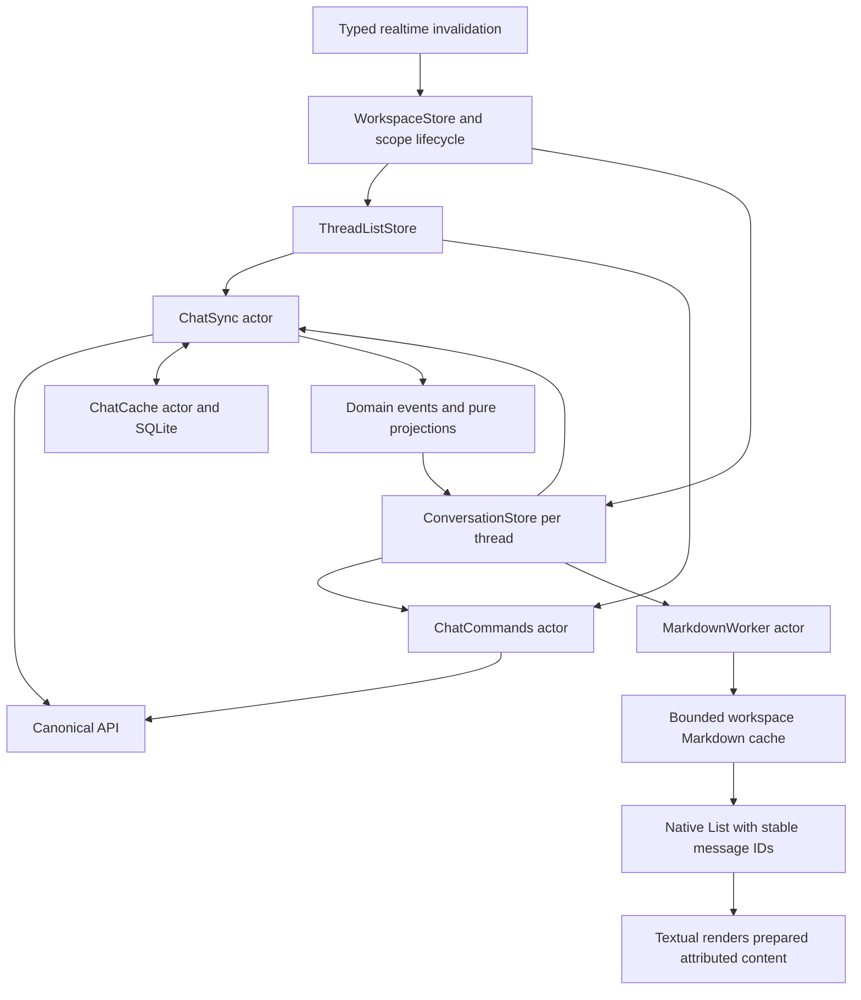

# Chat UI architecture

## Reference

The primary reference is the [official Telegram iOS client](https://github.com/TelegramMessenger/Telegram-iOS).
The following source was inspected at commit
`6ad963e5b62d354da79040f388ae2b9132fb17b8` on October 7, 2026.
Telegram uses UIKit and its own display nodes, list transactions, and reactive
data layer. The useful reference is how it separates work and preserves state.
The Okou implementation described here is independently written.

| Responsibility                            | Telegram reference                                                                                                                                                                                                                                        | Okou ownership                                                                        |
| ----------------------------------------- | --------------------------------------------------------------------------------------------------------------------------------------------------------------------------------------------------------------------------------------------------------- | ------------------------------------------------------------------------------------- |
| Account and feature services              | [TelegramEngine](https://github.com/TelegramMessenger/Telegram-iOS/blob/6ad963e5b62d354da79040f388ae2b9132fb17b8/submodules/TelegramCore/Sources/TelegramEngine/TelegramEngine.swift)                                                                     | AuthenticationService; workspace-scoped ChatSync, ChatCommands, and feature stores    |
| Serialized durable data                   | [Postbox](https://github.com/TelegramMessenger/Telegram-iOS/blob/6ad963e5b62d354da79040f388ae2b9132fb17b8/submodules/Postbox/Sources/Postbox.swift)                                                                                                       | ChatCache actor; raw snapshots and ordered events                                     |
| Stable history updates                    | [PreparedChatHistoryViewTransition](https://github.com/TelegramMessenger/Telegram-iOS/blob/6ad963e5b62d354da79040f388ae2b9132fb17b8/submodules/TelegramUI/Sources/PreparedChatHistoryViewTransition.swift)                                                | ChatEventProjection; stable message IDs in the native List                            |
| Visible rows and asynchronous preparation | [ListView](https://github.com/TelegramMessenger/Telegram-iOS/blob/6ad963e5b62d354da79040f388ae2b9132fb17b8/submodules/Display/Source/ListView.swift)                                                                                                      | Native List virtualization; MarkdownWorker actor                                      |
| Reusable text preparation                 | [ChatMessageTextBubbleContentNode](https://github.com/TelegramMessenger/Telegram-iOS/blob/6ad963e5b62d354da79040f388ae2b9132fb17b8/submodules/TelegramUI/Components/Chat/ChatMessageTextBubbleContentNode/Sources/ChatMessageTextBubbleContentNode.swift) | MessageMarkdownCache; value-based MessageBodyView equality                            |
| Directional gesture recognition           | [InteractiveTransitionGestureRecognizer](https://github.com/TelegramMessenger/Telegram-iOS/blob/6ad963e5b62d354da79040f388ae2b9132fb17b8/submodules/Display/Source/InteractiveTransitionGestureRecognizer.swift)                                          | SidebarPanGesture rejects vertical movement and restricts opening to the leading edge |

## Data and presentation flow

The server event protocol remains the authority. Presentation caches contain
derived content, have no synchronization cursors, and are disposable. Each
WorkspaceStore owns its Markdown cache, so account/workspace replacement also
replaces that cache. Closing the store or receiving a memory warning clears it.

## Feature and task ownership

WorkspaceStore owns selection, new-chat creation, realtime invalidation batching,
and the lifetime of its feature stores. The cache scope is supplied when the
store is created and cannot be rebound while requests are in flight. Session
identity still fences network tokens; durable cache identity remains API origin,
user, and workspace so a renewed session can reuse confirmed data.

ThreadListStore owns the thread list, navigation data, and list action state.
ConversationStore owns one thread's projected history, draft, optimistic inputs,
and loading/send/stop state. Detail views consume the conversation directly;
the composer accepts a draft binding and explicit action inputs. They do not
index workspace-wide message or operation dictionaries.

Each feature store owns its refresh task and coalesces invalidations received
while it is running into a subsequent read. Closing a workspace cancels its
creation, refresh, pruning, navigation, list-action, and conversation tasks.
ChatSync additionally serializes per-thread catch-up across actor suspension
points, including reads performed by Stop. ChatCommands owns mutations and
retains the existing shared-setting preparation and verification before Send.
A persistent event with the original client event ID remains the only successful
reconciliation of a pending input, including a revoked input.

Thread-list notifications refresh the list. Message notifications refresh their
resident conversation and the indicator snapshot; detail notifications refresh
their resident conversation. Read-cursor notifications refresh indicators.
Reconnect and foreground activation catch up the list and selected conversation.
Unopened conversations catch up when opened. Notifications carry invalidation
identities only, never authoritative message content. HTTP 426 from navigation,
indicators, or conversation operations blocks the workspace and closes its work.

Wire rows, snapshot DTOs, raw JSON, and synchronization cursors remain in the
network/data layer. They convert to ChatEvent, ChatThreadChange, and ChatThread
before pure domain replay. The raw bytes and existing SQLite schema remain
unchanged, so installed-client caches and API payloads need no migration.

The workspace normally retains up to eight conversation stores in least-recently
used order. This is a soft count bound: selection, drafts, pending delivery,
active work, and ongoing operations protect a conversation. Dirty raw rows from
a failed SQLite write also prevent eviction until persistence succeeds. A memory
warning clears Markdown preparation and releases eligible dormant conversations,
including their clean raw history cache. Reopening hydrates SQLite and catches up
from its cursor; event replay is never truncated to achieve a memory bound.

Network decoding, event replay, and SQLite access belong to their existing
service/storage actors. Markdown parsing now runs serially on a separate actor.
The last four messages are prepared before publishing history, because that is
the initial landing viewport. Older messages prepare on demand. Concurrent
requests for the same source share work. The cache retains at most 256 entries
and an estimated 8 MiB of source/attributed-run cost; this is not a process RSS
limit. A single oversized message can still render without being cached.

The prepared parser matches Textual 0.5.0's Foundation parser with no optional
syntax extensions. Changes to that dependency or enabling extensions require
checking this contract. Textual still performs SwiftUI layout, attachment
loading, selection, and syntax highlighting on its own execution paths;
background Markdown parsing does not make all rendering asynchronous.

## Interaction and update rules

- Opening the sidebar starts at the leading 28 points and requires predominantly
  horizontal movement. Position tracks the finger and settles using distance or
  velocity. A cancelled gesture returns to its starting state.
- Swiping left on the exposed main panel closes the sidebar. The sidebar list
  retains its own archive swipe actions. Code and tables retain horizontal
  scrolling outside the opening edge.
- Capture the original touch position before recognition. Allow simultaneous
  recognition with SwiftUI/UIKit recognizers while rejecting unrelated drags
  through the direction/edge gate;
  these include relationship and responder recognizers, not only pan subclasses.
- Initial history positioning happens without an insertion animation. A new
  incoming message follows only while the user is following the bottom. A local
  send requests bottom positioning. The explicit bottom button resumes following.
- User scrolling stops automatic following. Content growth corrects an existing
  bottom request only when the viewport is actually away from the bottom.
  Measurements at the bottom do not issue another scroll command. Refreshing
  equal history does not publish another history value, and equal message bodies
  skip rebuilding their renderer.
- Prepared content is tied to its source. Cancelled/recycled row tasks cannot
  install an old result into a newer message.

## Further evolution

Keep the durable protocol and presentation pipeline separate. If profiling shows
that long individual Markdown messages still spend too much time in SwiftUI
layout, the next renderer experiment should use a native collection view and
measured text/block layout, behind the same ChatMessage input. Telegram's
asynchronous node layout is a useful design reference for that experiment.
Migrating the whole application to a new UI framework is not needed to try it.

Keep feature state isolated as capabilities grow. A Swift Package boundary and
windowed history presentation can be considered separately after measuring
remaining coupling or long-history costs. API contract generation and CI consumer
selection are outside this iOS-only ownership refactor.

## Acceptance

Automated checks cover pinned-renderer attribute parity, relative links/images,
cache eviction, oversized content, source changes, and workspace isolation.
Existing synchronization, replay, cache, and send-recovery tests remain required.

The October 7 ownership refactor passed all 57 XCTest cases with zero failures
and a Debug simulator build on Xcode 26.3. HTTP-boundary regressions cover
targeted invalidation, SQLite rehydration after memory release, draft and pending
input retention, dirty-cache write recovery, and workspace-wide upgrade blocking.
These checks do not establish new visual or device performance results.

Interactive acceptance covers sidebar opening/closing and cancellation, vertical
history scrolling, horizontal code/table scrolling, bottom positioning, refresh
while reading history, message/code copying, and keyboard/composer behavior.
Use a physical device with a Release build and Animation Hitches to assess frame
pacing. Debug simulator responsiveness and CPU samples do not establish a
device frame-rate improvement.

### October 7, 2026 checkpoint

- The signed iPhone 17 Pro / iOS 26.3 simulator build and all 56 tests passed.
  Swift formatting and documentation formatting checks passed.
- A CPU sample during real conversation loading captured `MarkdownWorker.parse`
  on a worker thread. This verifies execution placement, not a frame-rate gain.
- An existing long conversation with a table loaded and reached the latest
  message and footer. Interactive checking exposed an initial-position regression
  when content acquired its final height; the conditional growth correction
  restored bottom positioning in that conversation.
- Native accessibility button actions worked, but the computer-use tool returned
  `noWindowsAvailable` for drag/scroll input even after reselecting the simulator
  window. Scrolling feel and physical-device frame pacing remain unverified.
  The gesture tests cover direction, edge boundaries,
  release distance/velocity, and cancellation policy.
- Manual acceptance reproduced an opening failure: the pan entered recognition
  but received no update callbacks. Allowing simultaneous recognition beyond
  `UIPanGestureRecognizer` fixed arbitration with responder/relationship
  recognizers. Capturing the touch origin also removed a recognition-threshold
  offset from the edge check. The user then confirmed edge opening and closing
  from the exposed main panel; local logs captured complete begin/change/end
  callbacks.
  Temporary diagnostic logging was removed. The automation tool's later drag
  sent touch down/up without intervening move events, so manual acceptance was
  used for this gesture regression.
